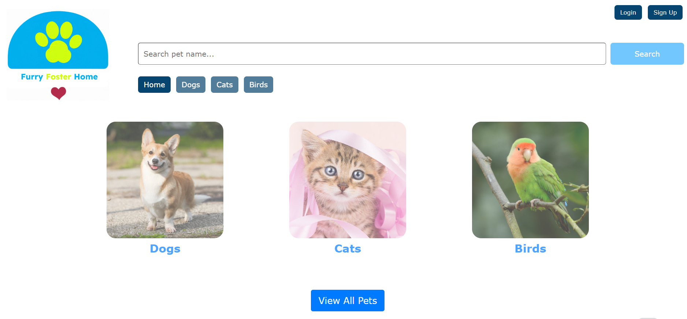

# Furry Foster Home
  
  ## Description
  This web application is designed to showcase domestic animals available in the Furry foster Home for adoption. 
  Users can view all pets from the homepage or select the desired type of animal to browse. Each pet has their own info page which displays more details about the animal. Sign up and login function is available where users can create and update their personal details on their profile.

  ## Table of Contents
  - [Description](#description)
  - [Usage](#usage)
  - [Technology](#technology)
  - [Roadmap](#Roadmap)
  - [Contributing](#contributing)
 
  ## Usage
  Deployed application link: https://furryfosterhome.herokuapp.com/

  On the homepage, you can click on the "View all pets" button to show all animals available for adoption. Click on the animal category image to browse a specific type of animal. Clicking on the pet image will take you to the pet detail page where the adopt option is available for logged in users. If user is not logged in, they will be redirected to the login page when "adopt" button is clicked. 
  Users can choose to sign up instead if they don't already have an account. Once the user is logged in, they can view their personal details by clicking on their email address displayed at the top right corner of the page. This will direct the page to the user profile page where users can view and edit their personal information.  
  Below is a screenshot of the deployed webpage:

  ## Technology
  This application requires npm packages: MySQL2, Sequelize and Express packages to connect the MySQL database to API calls. The dotenv package is required to use environment variables to store sensitive data such as MySQL username, password and database name. 
  To test the application on your local machine, you will need to install the packages by entering "npm i" in visual studio command line. Once installed, create the schema from the MySQL shell with the command "mysql -u root -p" followed by your password, then "source schema.sql". Run "npm run seed" to seed the data to your database. Then you are ready to start the application server by running "npm start". The various API request routes can then be tested in Insomnia.

  ## Contributing
  If you would like to contribute to this project, head to my GitHub page at https://github.com/NikTern/Furry-Foster-Home.git to see details of the application code. 

  ## Roadmap
  Our team of developers are working on adding new features and functions to the web application. Some of the improvements our team is looking to implement in the next update include additional search filters, such as breed, size, age, and gender to the search bar to allow better user experience. This will facilitate users to quickly find and view their desired pet easily. We would also like to enable a function that allows logged in users to save a pet to favourite, so they can shortlist the pets they would like to consider for adoption.
  